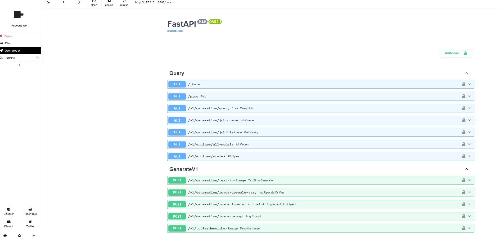

# Running Fooocus API locally one click with Pinokio

## Setup

- Go to pinokio app -> download with url -> copy & paste git url -> download
- Click install waiting finish setup

## Model download

- If you already have Fooocus installed, and it is work well, The recommended way is to reuse models, you just simple copy config.txt file from your local Fooocus folder to Fooocus-API root folder.

Use this method you will have both Fooocus and Fooocus-API running at the same time. And they operate independently and do not interfere with each other.

- If not have Fooocus installed you can run API it will auto download for you but model size are big around 6G for realistic

## Run Api

- click run and open <http://127.0.0.1:8888/docs>

# Disclaimer

Confirmed working on Windows with Nvidia GPU, it may work with M1/M2 Mac and Linux too, but may not work on AMD and Intel Mac. If you get it to work, please let me know in open issue

## API repo

<https://github.com/mrhan1993/Fooocus-API>
